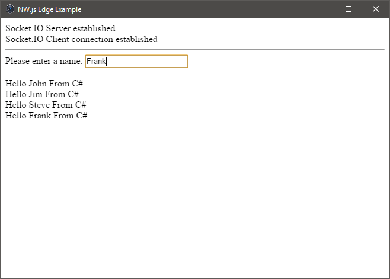

# nwjs-edge-example (Edge spawned via separate Node process)

An example using NW.js and Edge that involves spawning the Edge related code in
a separate Node process and then interfacing with NW.js via Socket.IO. This will
allow Edge to be built for regular Node and take away the complexity of building
it for NW.js.

## Dependencies

We'll need a copy of the `Node.exe` and `Node.lib`:

https://nodejs.org/dist/v5.9.1/win-x64/

NW.js:

http://nwjs.io/

Grunt:

http://gruntjs.com/

Bower:

http://bower.io/

## Building

- Clone or download copy of this repository
- Download the `Node.exe` and `Node.lib` files from https://nodejs.org/dist/v5.9.1/win-x64 or a copy that works for your OS and copy the files to the root of the repository
- Open a command line and change to the directory for this repository
- Run `npm install` on the command line to install all backend npm module dependencies
- Run `bower install` on the command line to install all frontend dependencies
- Run `grunt` on the command line to build the code

## Running

- Unzip `NW.js`
- Open command line to the NW.js folder
- Run `nw.exe <path-to-nwjs-edge-example>`

## Author(s)

Frank Hale &lt;frankhale@gmail.com&gt;  
30 May 2016

## License

GNU GPL v3 - see [LICENSE](LICENSE)
